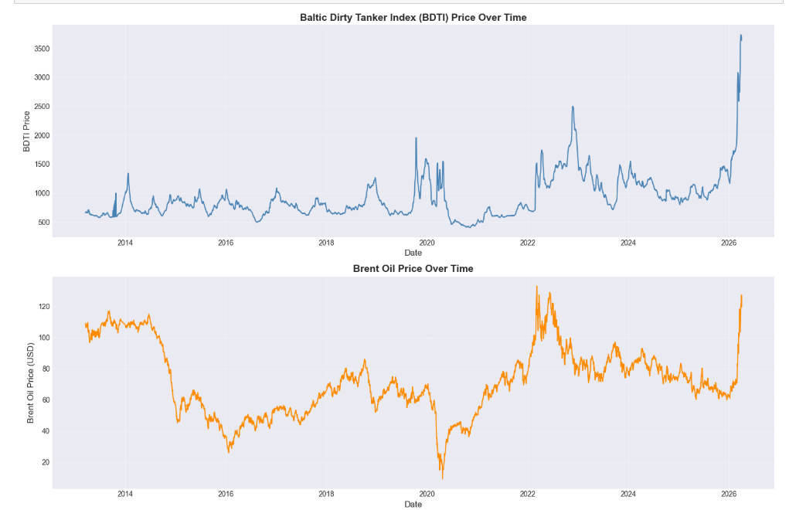
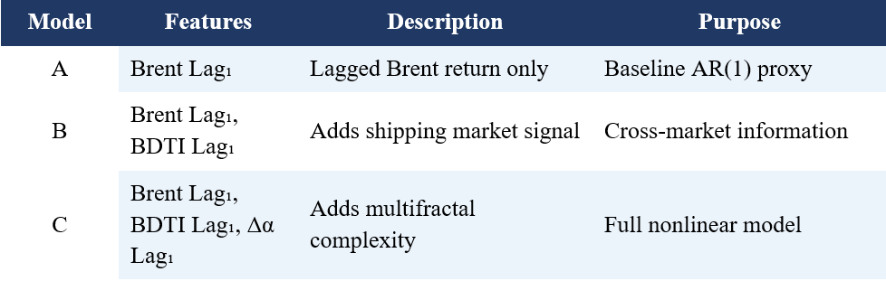
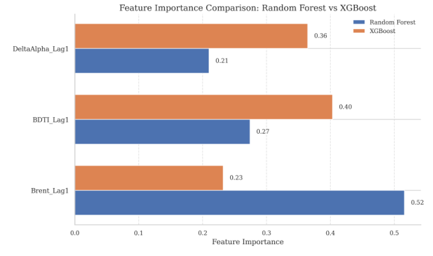
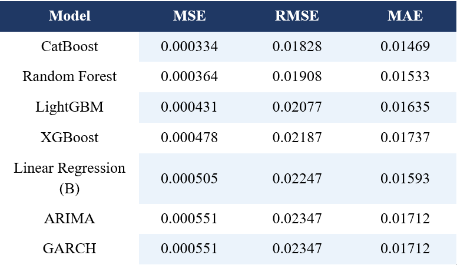

# 📈 A Multifractal and Regime-Based Forecasting Framework for Brent Crude and BDTI Returns

> **Hybrid financial time series forecasting using Multifractal Detrended Fluctuation Analysis (MF-DFA), market regime detection, and ensemble machine learning models.**

---

## 📖 Overview

Financial markets exhibit nonlinear and regime-dependent behavior, making accurate forecasting a challenging task.

This project presents a hybrid forecasting framework that integrates **Multifractal Detrended Fluctuation Analysis (MF-DFA)**, **market regime detection**, and **ensemble machine learning models** to forecast **next-day Brent Crude Oil returns**.

The framework combines traditional financial indicators with multifractal complexity measures to investigate how market dynamics influence forecasting performance under different market conditions.

This work was developed as part of my **Integrated MSc in Data Science thesis**.

---

# 📌 Key Features

- 📊 Financial Time Series Forecasting
- 📈 Multifractal Detrended Fluctuation Analysis (MF-DFA)
- 📉 Binary Segmentation for Market Regime Detection
- 🌍 Brent Crude Oil & BDTI Analysis
- 🤖 Ensemble Machine Learning Models
- 📊 Feature Engineering
- 📉 Regime-wise Performance Analysis
- 📈 Volatility-Stratified Evaluation

---

# 🔄 Methodology

The overall workflow of the proposed forecasting framework is shown below.

<p align="center">

</p>

---

# 📊 Exploratory Data Analysis

### Brent Crude Oil and BDTI Time Series

<p align="center">

</p>

---

# 🧩 Feature Engineering

The forecasting framework uses lagged financial variables together with multifractal features extracted using MF-DFA.

<p align="center">

</p>

Three feature configurations were evaluated.

| Model | Features |
|--------|----------|
| **Model A** | Brent Return Lag₁ |
| **Model B** | Brent Return Lag₁ + BDTI Return Lag₁ |
| **Model C** | Brent Return Lag₁ + BDTI Return Lag₁ + Δα Lag₁ |

---

# 🤖 Machine Learning Models

The following forecasting models were implemented and compared.

### Ensemble Models

- Random Forest
- XGBoost
- LightGBM
- CatBoost

### Baseline Models

- Linear Regression
- ARIMA
- GARCH

---

# 📈 Feature Importance

Feature importance obtained from the Random Forest model.

<p align="center">

</p>

---

# 📊 Model Performance Comparison

Performance comparison of all forecasting models.

<p align="center">

</p>

---

# 📉 Regime-wise Performance

Performance improvement obtained by incorporating multifractal information across different market regimes.

<p align="center">

</p>

---

# 📈 Evaluation Metrics

Models were evaluated using:

- Mean Squared Error (MSE)
- Root Mean Squared Error (RMSE)
- Mean Absolute Error (MAE)

---

# 🛠 Technologies Used

- Python
- Jupyter Notebook
- NumPy
- Pandas
- SciPy
- Matplotlib
- Seaborn
- Scikit-learn
- Statsmodels
- Ruptures
- XGBoost
- LightGBM
- CatBoost

---

# 📂 Repository Structure

```text
multifractal-regime-forecasting-for-crude-oil/

│
├── data/
│
├── docs/
│   ├── thesis_report.pdf
│   └── research_manuscript.pdf
│
├── images/
│
├── notebook/
│   └── multifractal_regime_forecasting.ipynb
│
├── requirements.txt
├── .gitignore
└── README.md
```

---

# 🚀 Getting Started

Clone the repository

```bash
git clone https://github.com/Lek0007/multifractal-regime-forecasting-for-crude-oil.git
```

Move into the project directory

```bash
cd multifractal-regime-forecasting-for-crude-oil
```

Install dependencies

```bash
pip install -r requirements.txt
```

Launch Jupyter Notebook

```bash
jupyter notebook
```

Open

```text
notebook/multifractal_regime_forecasting.ipynb
```

Run all cells sequentially.

---

# 📁 Dataset

The project utilizes historical daily observations of:

- Brent Crude Oil Prices
- Baltic Dirty Tanker Index (BDTI)

The dataset included in this repository is intended for academic and research purposes.

---

# 📄 Documentation

The `docs/` directory contains:

- 📘 Integrated MSc Thesis Report
- 📄 Research Manuscript (Unpublished)

Both documents describe the complete methodology, experiments, and findings.

---

# 🎯 Key Contributions

- Developed a hybrid forecasting framework integrating MF-DFA with machine learning.
- Engineered multifractal spectrum width (Δα) as a predictive feature.
- Detected structural market regimes using Binary Segmentation.
- Compared ensemble learning algorithms with classical statistical forecasting models.
- Evaluated forecasting performance under different market regimes and volatility conditions.

---

# 🔮 Future Work

Potential extensions include:

- LSTM and Transformer-based forecasting
- Explainable AI using SHAP
- Bayesian Hyperparameter Optimization
- Real-time forecasting dashboard
- Live financial data integration

---

# 👨‍💻 Author

**L V**

Integrated MSc in Data Science

GitHub: https://github.com/Lek0007

---

## ⭐ If you found this project interesting, consider giving it a star!
