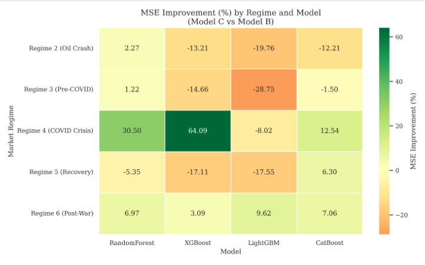

# 📈 A Multifractal and Regime-Based Forecasting Framework for Brent Crude and BDTI Returns

> **A hybrid financial time series forecasting framework integrating Multifractal Detrended Fluctuation Analysis (MF-DFA), market regime detection, and ensemble machine learning models for forecasting Brent Crude Oil returns.**

---

## 📖 Overview

Financial markets exhibit nonlinear, non-stationary, and regime-dependent behavior, making accurate forecasting a challenging task.

This project proposes a **hybrid forecasting framework** that combines **Multifractal Detrended Fluctuation Analysis (MF-DFA)**, **market regime detection**, and **ensemble machine learning algorithms** to predict **next-day Brent Crude Oil returns**.

Unlike traditional forecasting approaches, this framework incorporates **multifractal complexity (Δα)** as a predictive feature and evaluates forecasting performance across different market regimes.

This work was completed as part of my **Integrated MSc in Data Science thesis**.

---

# 🚀 Project Workflow

The overall methodology followed in this project is illustrated below.

<p align="center">

</p>

---

# 📊 Dataset

The project utilizes historical daily observations of:

- Brent Crude Oil Prices
- Baltic Dirty Tanker Index (BDTI)

The study covers multiple market events including:

- 2014 Oil Price Crash
- COVID-19 Market Shock
- Russia–Ukraine Conflict

<p align="center">

</p>

---

# 🧩 Feature Engineering

Three progressively enriched feature configurations were evaluated.

| Configuration | Features |
|--------------|----------|
| **Model A** | Brent Return Lag₁ |
| **Model B** | Brent Return Lag₁ + BDTI Return Lag₁ |
| **Model C** | Brent Return Lag₁ + BDTI Return Lag₁ + Multifractal Spectrum Width (Δα) Lag₁ |

The inclusion of **Δα**, obtained from MF-DFA, enables the models to capture the evolving complexity of financial markets.

---

# 🤖 Forecasting Models

### Machine Learning Models

- Random Forest
- XGBoost
- LightGBM
- CatBoost
- Linear Regression

### Statistical Models

- ARIMA
- GARCH

---

# 📈 Model Performance

The final forecasting performance comparison is shown below.

<p align="center">

</p>

Among all evaluated models, **CatBoost achieved the best overall forecasting performance**, followed by Random Forest and LightGBM.

---

# 🌍 Regime-wise Analysis

One of the main objectives of this work was to evaluate whether multifractal information improves forecasting under different market conditions.

The figure below shows the percentage improvement in Mean Squared Error (MSE) obtained by incorporating multifractal features across different market regimes.

<p align="center">

</p>

The results demonstrate that multifractal features provide meaningful improvements during several market regimes, particularly during periods of elevated volatility.

> **Note:** Replace the filename above (`MSE_Improvement_across_regimes_heatmap.png`) with the exact filename from your repository if it differs.

---

# 📊 Evaluation Metrics

The forecasting models were evaluated using:

- Mean Squared Error (MSE)
- Root Mean Squared Error (RMSE)
- Mean Absolute Error (MAE)

---

# 🛠 Technologies Used

- Python
- Jupyter Notebook
- NumPy
- Pandas
- SciPy
- Matplotlib
- Seaborn
- Scikit-learn
- Statsmodels
- Ruptures
- XGBoost
- LightGBM
- CatBoost

---

# 📂 Repository Structure

```text
multifractal-regime-forecasting-for-crude-oil/

│
├── data/
│
├── docs/
│   ├── thesis_report.pdf
│   └── research_manuscript.pdf
│
├── images/
│
├── notebook/
│   └── multifractal_regime_forecasting.ipynb
│
├── requirements.txt
├── .gitignore
└── README.md
```

---

# 🚀 Getting Started

Clone the repository

```bash
git clone https://github.com/Lek0007/multifractal-regime-forecasting-for-crude-oil.git
```

Move into the project directory

```bash
cd multifractal-regime-forecasting-for-crude-oil
```

Install the required dependencies

```bash
pip install -r requirements.txt
```

Launch Jupyter Notebook

```bash
jupyter notebook
```

Open

```text
notebook/multifractal_regime_forecasting.ipynb
```

Run all cells sequentially.

---

# 📁 Repository Contents

- 📓 Complete implementation in Jupyter Notebook
- 📊 Dataset used for the study
- 📄 MSc Thesis Report
- 📝 Research Manuscript (Unpublished)
- 📈 Figures and visualizations

---

# 🎯 Key Contributions

- Developed a hybrid forecasting framework integrating MF-DFA with ensemble machine learning.
- Engineered multifractal spectrum width (Δα) as a predictive feature.
- Applied Binary Segmentation for market regime detection.
- Compared machine learning models with classical statistical forecasting approaches.
- Performed regime-wise evaluation to analyze forecasting robustness under different market conditions.

---

# 🔮 Future Work

Possible extensions include:

- Deep Learning models (LSTM, GRU, Transformer)
- Explainable AI (SHAP/LIME)
- Bayesian Hyperparameter Optimization
- Real-time forecasting pipeline
- Interactive dashboard deployment

---

# 👨‍💻 Author

**L V**

Integrated MSc in Data Science

GitHub: https://github.com/Lek0007

---

## ⭐ If you found this project useful, consider giving it a star!
